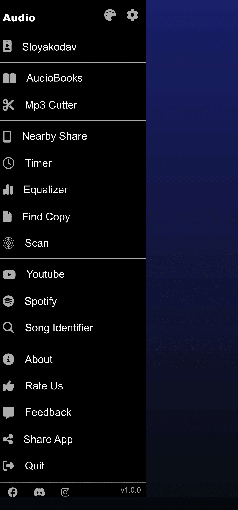

### Sort Song Section

## this section used to sort the songs by date or albums what and whatever sort that exsit there this section can be seen when you click at sort part that exist on the song page (page-2) its responsive because when you click at any sort that exist on this section the sort also change

```html
<div class="sortTheSongs">
  <div class="closeSort"></div>
  <div class="SortSongCont">
    <div class="sortOrder">sort order</div>
    <div class="SortBy">
      <div class="sortItBy sortItByTitle">title</div>
      <div class="sortItBy sortItByArtist">artist</div>
      <div class="sortItBy sortItByAlbum">album</div>
      <div class="sortItBy sortItByAlbumArtist">album artist</div>
      <div class="sortItBy sortItByComposer">composer</div>
      <div class="sortItBy sortItBySize">size</div>
      <div class="sortItBy sortItByYear">year</div>
      <div class="sortItBy sortItByDateAdded">date added</div>
      <div class="sortItBy sortItByDateModified">date modified</div>
    </div>
  </div>
</div>
```


### Settings Section

## this part is used for song sittings it showed when you click at any sittings ( 3 dots) that exist on a song container this sittings section have multiple sittings

```html
<div class="sittings-sage">
  <div class="cancelSittingsSage"></div>
  <div class="sittingsSageContFor">
    <div class="songContainer">
      <div class="songHlf">
        `

        
        <div class="SongText">
          <div class="songName">je te lasserai des moi</div>
          <div class="songInfo">
            <div class="songCreator">casmas linx</div>
            <div class="addTime">7 days ago</div>
            <div class="TimeOfSong">3:05</div>
          </div>
        </div>
        >
      </div>
      <div class="songSittings bro">
        <div class="justCeruse"></div>
        <i class="fa-regular fa-heart bro"></i>
      </div>
    </div>
    <div class="firstCon">
      <div class="firstOne">
        <i class="fa-solid fa-arrow-right"></i>
        <p class="textFIRSTONE">Play Next</p>
      </div>
      <div class="firstOne">
        <i class="fa-solid fa-list-ul"></i>
        <p class="textFIRSTONE">Add to playing queue</p>
      </div>
      <div class="firstOne">
        <i class="fa-solid fa-circle-plus"></i>
        <p class="textFIRSTONE">Add to playlist</p>
      </div>
      <div class="firstOne">
        <i class="fa-solid fa-share"></i>
        <p class="textFIRSTONE">Nearby share</p>
      </div>
    </div>
    <div class="firstCon">
      <div class="firstOne">
        <i class="fa-solid fa-record-vinyl"></i>
        <p class="textFIRSTONE">Go to album</p>
      </div>
      <div class="firstOne">
        <i class="fa-solid fa-id-badge"></i>
        <p class="textFIRSTONE">Go to list</p>
      </div>
      <div class="firstOne">
        <i class="fa-brands fa-youtube"></i>
        <p class="textFIRSTONE">Go to artist</p>
      </div>
    </div>
    <div class="firstCon">
      <div class="firstOne">
        <i class="fa-solid fa-pen"></i>
        <p class="textFIRSTONE">Find on youtube</p>
      </div>
      <div class="firstOne">
        <i class="fa-solid fa-circle-info"></i>
        <p class="textFIRSTONE">Tag editor</p>
      </div>
      <div class="firstOne">
        <i class="fa-solid fa-scissors"></i>
        <p class="textFIRSTONE">Details</p>
      </div>
      <div class="firstOne">
        <i class="fa-solid fa-phone"></i>
        <p class="textFIRSTONE">Mp3 editor</p>
      </div>
      <div class="firstOne">
        <i class="fa-solid fa-circle-minus"></i>
        <p class="textFIRSTONE">Add to black list</p>
      </div>
    </div>
    <div class="firstCon">
      <div class="firstOne">
        <i class="fa-solid fa-share-nodes"></i>
        <p class="textFIRSTONE">share</p>
      </div>
      <div class="firstOne">
        <i class="fa-solid fa-trash"></i>
        <p class="textFIRSTONE">Delete from device</p>
      </div>
    </div>
  </div>
</div>
`
```


### See All Section

## this section have a part of what you want to see (favorit most played ex...) it shows when you click at see all that exist at the sugg part

```html
<div class="seeAllPage-sage">
 <div class="seeAllPage">`
      <div class="Chsl">
        <div class="closeSeeAll">
          <div class="closeAll">
            <i class="fa-solid fa-arrow-right-to-bracket"></i>
          </div>
          <div class="dotsee">
            <i class="fa-solid fa-ellipsis-vertical"></i>
          </div>
        </div>
        <div class="seeAllSongInfoAndPic">
          <div class="albumPics-4">
            <div class="albumPics-2">
                
                </img>
                
                </img>
            </div>
            <div class="albumPics-2">
                
                </img>
                
                </img>
            </div>
          </div>
          <div class="SeeAllText">
            <div class="Text">
              resentPlayed
            </div>
            <div class="Time">
              29 songs 3:20:21
              </div>
          </div>
        </div>
        <div class="playSitt">
          <div class="playAllOrShiffle">
            <i class="fa-solid fa-play"></i>
            <div>PLAY ALL</div>
          </div>
          <div class="playAllOrShiffle">
            <i class="fa-solid fa-shuffle"></i>
            <div>SHUFFLE</div>
          </div>
        </div>
      </div>
      <div class="songContainer">
        <div class="songHlf">
          
              <div class="SongText">
                  <div class="songName">je te lasserai des moi</div>
                  <div class="songInfo">
                    <div class="songCreator">casmas linx</div>
                    <div class="addTime">7 days ago</div>
                    <div class="TimeOfSong">3:05</div>
                  </div>
              </div>
            </a>
        </div>
        <div class="songSittings">
            <i class="fa-solid fa-ellipsis-vertical" aria-hidden="true"></i>
        </div>
      </div>
            <div class="songContainer">
        <div class="songHlf">
        
              <div class="SongText">
                  <div class="songName">je te lasserai des moi</div>
                  <div class="songInfo">
                    <div class="songCreator">casmas linx</div>
                    <div class="addTime">7 days ago</div>
                    <div class="TimeOfSong">3:05</div>
                  </div>
              </div>
            </a>
        </div>
        <div class="songSittings">
            <i class="fa-solid fa-ellipsis-vertical" aria-hidden="true"></i>
        </div>
      </div>
    </div>
    </div>
```


### profile sittings

## this section have the profile page that have the name username and achievements also the profile normal things as following part and post (songs) this section shows when you click at the profile part that exist on the nav

```html
<div class="profile-sage">
  <div class="profileCont">
    <div class="cover">
      <div class="closeProfile">
        <i class="fa-solid fa-arrow-right-to-bracket"></i>
      </div>
    </div>
    <div class="controleIt">
      <div class="profilePic"></div>
    </div>
    <div class="name">
      <div class="profileName">brahim</div>
      <div class="username">@sloyakodav</div>
    </div>
    <div class="achievement">
      achievement
      <div class="padges">
        <div class="iconys">
          <i class="fa-solid fa-trophy"></i>
        </div>
        <div>listener of the year</div>
      </div>
    </div>
    <div class="bio">This guy loves music and coding</div>
    <div class="contsSlides">
      <div class="songsCreated">Songs</div>
      <div class="favoritSv">favorite</div>
      <div class="followingArtist">follow</div>
    </div>

    <div class="profileSlides-1">
      <div class="FirstTY">
        <div
          className="songCreatorOnes"
          style="padding:3rem;
    text-transform: capitalize"
        >
          <div className="songy" style="text-align: center">no songs yet</div>
        </div>
      </div>
    </div>
  </div>
</div>
```


### search

## this section have a search input and a cancele part that get you out of this section to the main app page this section shows when you click at the search part that exist at the nav part

```html
<div class="search-sage">
  <div class="searchBar">
    <div class="searchsy">
      <div class="divInput">
        <div class="searchIcon">
          <i class="fa-brands fa-searchengin"></i>
        </div>
        <input class="InputSearch" type="text" placeholder="Search" />
        <div class="micSearch">
          <i class="fa-solid fa-microphone"></i>
        </div>
      </div>
    </div>
    <div class="close-searchBar">cancel</div>
  </div>
  <div class="empty"></div>
</div>
```


### side nav section

## this section have multiple sittings like profile and share this section shows when you click at the sideSittings( 3 lines) that exist on the nav

```html
<div class="audioNavSideBar">
  <div class="sideBar">
    <div class="sideBar-5 pd-0">
      <div class="audiofirst">
        <div class="audioTextSideBar">Audio</div>
        <div class="themeAndSittings">
          <div class="theme">
            <i class="fa-solid fa-palette"></i>
          </div>
          <div class="sittingsSteam">
            <i class="fa-solid fa-gear"></i>
          </div>
        </div>
      </div>
      <div class="audioSecSideBar icon">
        <div class="accountSy">
          <i class="fa-solid fa-id-badge"></i>
        </div>
        <div class="accountText">sloyakodav</div>
      </div>
    </div>
    <div class="sideBar-5">
      <div class="icon">
        <i class="fa-solid fa-book-open"></i>
        <div>audioBooks</div>
      </div>
      <div class="icon">
        <i class="fa-solid fa-scissors"></i>
        <div>mp3 cutter</div>
      </div>
    </div>
    <div class="sideBar-5">
      <div class="icon">
        <i class="fa-solid fa-mobile-screen"></i>

        <div>nearby share</div>
      </div>
      <div class="icon">
        <i class="fa-regular fa-clock"></i>

        <div>timer</div>
      </div>
      <div class="icon">
        <i class="fa-solid fa-chart-simple"></i>

        <div>equalizer</div>
      </div>
      <div class="icon">
        <i class="fa-solid fa-file"></i>
        <div>find copy</div>
      </div>
      <div class="icon">
        <i class="fa-brands fa-nfc-directional"></i>
        <div>scan</div>
      </div>
    </div>
    <div class="sideBar-5">
      <div class="icon">
        <i class="fa-brands fa-youtube"></i>
        <div>youtube</div>
      </div>
      <div class="icon">
        <i class="fa-brands fa-spotify"></i>
        <div>spotify</div>
      </div>
      <div class="icon">
        <i class="fa-solid fa-magnifying-glass"></i>
        <div>song identifier</div>
      </div>
    </div>
    <div class="sideBar-5">
      <div class="icon">
        <i class="fa-solid fa-circle-info"></i>

        <div>about</div>
      </div>
      <div class="icon">
        <i class="fa-solid fa-thumbs-up"></i>
        <div>rate us</div>
      </div>
      <div class="icon">
        <i class="fa-solid fa-message"></i>
        <div>feedback</div>
      </div>
      <div class="icon">
        <i class="fa-solid fa-share-nodes"></i>
        <div>share app</div>
      </div>
      <div class="icon">
        <i class="fa-solid fa-right-from-bracket"></i>
        <div>quit</div>
      </div>
    </div>
    <div class="facebookInsta">
      <div class="logos">
        <div class="icon">
          <i class="fa-brands fa-facebook"></i>
        </div>
        <div class="icon">
          <i class="fa-brands fa-discord"></i>
        </div>
        <div class="icon">
          <i class="fa-brands fa-instagram"></i>
        </div>
      </div>
      <div class="logos">
        <div class="version">v1.0.0</div>
      </div>
    </div>
  </div>
  <div class="closeSideBar"></div>
</div>
```



### nav sittings section

## this section is a simple section that have 3 sittings it shows when you click at the nav sittings (3 dots ) that exist on the nav

```html
<div class="navSittingBox">
  <div class="flexContainer">
    <div class="justForFlex removeIT"></div>
    <div class="sittings3box">
      <div class="sittingsOneBox">shuffle all</div>
      <div class="sittingsOneBox">
        <p>grid size</p>
        <i class="fa-solid fa-caret-right"></i>
      </div>
      <div class="sittingsOneBox">sittings</div>
    </div>
  </div>
  <div class="forFlexAlso removeIT"></div>
</div>
```


### nav

## this nav have sideNav sittings (3 lines) and name of the app search profile and navSittings (3 dots)

```html
<nav class="nav-5">
  <!-- insideToClick  -->
  <div class="nav-5FirstContainer">
    <div class="sittings"><i class="fa-solid fa-list-ul"></i></div>
    <div class="nameOfApp bro">Musical</div>
  </div>
  <div class="nav-5secContainer">
    <div class="search">
      <div class="insideToClick insideToClick_1">
        <i class="fa-solid fa-magnifying-glass"></i>
      </div>
    </div>
    <div class="pro">
      <div class="insideToClick">
        <i class="fa-solid fa-user"></i>
      </div>
    </div>
    <div class="dots">
      <div class="insideToClick">
        <i class="fa-solid fa-ellipsis-vertical NavSittingsButton"></i>
      </div>
    </div>
  </div>
</nav>
```


### nav pages

## this nav have 7 parts that take you to same 7 pages with the same name

```html
<nav class="nav-7">
  <div class="suggested nav-item1">suggested</div>
  <div class="songs nav-item2">songs</div>
  <div class="albums nav-item3">albums</div>
  <div class="artists nav-item4">artists</div>
  <div class="playlists nav-item5">playlists</div>
  <div class="forlders nav-item6">folders</div>
  <div class="generes nav-item7">genres</div>
</nav>
```


### suggested

```html
<div class="page" id="page1">
      <main class="container">
        <div class="ResentContainer">
          <div class="resentPlayed countSong-date">
            <div class="resentText countSong">recently played</div>
            <div class="seeALl sort">See all</div>
          </div>
          <div class="musicScroll">
            <div class="OneMusic">
              <div class="musicImg">
                
              </div>
              <div class="MusicText">
                <div class="songName SSSS"> je te lasserai des mots</div>
                <div class="songInfo">casmas linx</div>
              </div>
            </div>
             <div class="OneMusic">
              <div class="musicImg">
                
              </div>
              <div class="MusicText">
                <div class="songName SSSS"> je te lasserai des mots</div>
                <div class="songInfo">casmas linx</div>
              </div>
            </div>   <div class="OneMusic">
              <div class="musicImg">
                
              </div>
              <div class="MusicText">
                <div class="songName SSSS"> je te lasserai des mots</div>
                <div class="songInfo">casmas linx</div>
              </div>
            </div>   <div class="OneMusic">
              <div class="musicImg">
                
              </div>
              <div class="MusicText">
                <div class="songName SSSS"> je te lasserai des mots</div>
                <div class="songInfo">casmas linx</div>
              </div>
            </div>   <div class="OneMusic">
              <div class="musicImg musicBack">
                
                <p class="textmore">
                  More
                  <i class="fa-solid fa-chevron-right"></i>
                </p>
              </div>
              <div class="MusicText">
                <div class="songName SSSS"> je te lasserai des mots</div>
                <div class="songInfo">casmas linx</div>
              </div>
            </div>
          </div>
        </div>
             <div class="mostPlayedContainer">
          <div class="mostPlayed countSong-date">
            <div class="mostPlayedText countSong">Most Played</div>
            <div class="seeALl sort">SEE ALL</div>
          </div>

          <div class="musicScroll">
            <div class="OneMusic">
              <div class="musicImg">
                
              </div>
              <div class="MusicText">
                <div class="songName SSSS"> je te lasserai des mots</div>
                <div class="songInfo">casmas linx</div>
              </div>
            </div>
             <div class="OneMusic">
              <div class="musicImg">
                
              </div>
              <div class="MusicText">
                <div class="songName SSSS"> je te lasserai des mots</div>
                <div class="songInfo">casmas linx</div>
              </div>
            </div>   <div class="OneMusic">
              <div class="musicImg">
                
              </div>
              <div class="MusicText">
                <div class="songName SSSS"> je te lasserai des mots</div>
                <div class="songInfo">casmas linx</div>
              </div>
            </div>   <div class="OneMusic">
              <div class="musicImg">
                
              </div>
              <div class="MusicText">
                <div class="songName SSSS"> je te lasserai des mots</div>
                <div class="songInfo">casmas linx</div>
              </div>
            </div>   <div class="OneMusic">
              <div class="musicImg musicBack">
                
                <p class="textmore">
                  More
                  <i class="fa-solid fa-chevron-right"></i>
                </p>
              </div>
              <div class="MusicText">
                <div class="songName SSSS"> je te lasserai des mots</div>
                <div class="songInfo">casmas linx</div>
              </div>
            </div>
          </div>
        </div>
        <!-- --- -->
           <div class="favoriteContainer">
          <div class="favoriteC  countSong-date ">
            <div class="favoritText countSong">favorite</div>
            <div class="seeALl sort">SEE ALL</div>
          </div>
          <div class="musicScroll">
             <div class="OneMusic">
              <div class="musicImg">
                
              </div>
              <div class="MusicText">
                <div class="songName SSSS"> je te lasserai des mots</div>
                <div class="songInfo">casmas linx</div>
              </div>
            </div>    <div class="OneMusic">
              <div class="musicImg">
                
              </div>
              <div class="MusicText">
                <div class="songName SSSS"> je te lasserai des mots</div>
                <div class="songInfo">casmas linx</div>
              </div>
            </div>
          </div>
        </div>
        <!-- --- -->
           <div class="favoriteContainer">
          <div class="favoriteC">
            <div class="favoritText"></div>
            <div class="seeALl"></div>
          </div>
          <div class="musicScroll">
            <div class="OneMusic">
              <div class="musicImg"></div>
              <div class="MusicText">
                <div class="songName"></div>
                <div class="songInfo"></div>
              </div>
            </div>

          </div>
        </div>
        <!-- -----  -->
         <div class="containerD">

      <div class="countSong-date">
        <div class="countSong">last added</div>
        <div class="seeALl sort">

          SEE ALL
        </div>


    </div><div class="songScroll">
      <!-- ---+++--- -->
      <div class="firstScrollPage">

          <div class="scrollOne">    <div class="songContainer widthFix">
        <div class="songHlf">

            
            <div class="SongText">
              <div class="songName">je te lasserai des moi</div>
              <div class="songInfo">
                <div class="songCreator">casmas linx</div>
                <div class="addTime">7 days ago</div>
                <div class="TimeOfSong">3:05</div>
              </div>
            </div></a
          >
        </div>
        <div class="songSittings">
          <i class="fa-solid fa-ellipsis-vertical"></i>
        </div>
      </div></div>
            <div class="scrollOne">    <div class="songContainer widthFix">
        <div class="songHlf">

            
            <div class="SongText">
              <div class="songName">je te lasserai des moi</div>
              <div class="songInfo">
                <div class="songCreator">casmas linx</div>
                <div class="addTime">7 days ago</div>
                <div class="TimeOfSong">3:05</div>
              </div>
            </div></a
          >
        </div>
        <div class="songSittings">
          <i class="fa-solid fa-ellipsis-vertical"></i>
        </div>
      </div></div>  <div class="scrollOne">    <div class="songContainer widthFix">
        <div class="songHlf">

            
            <div class="SongText">
              <div class="songName">je te lasserai des moi</div>
              <div class="songInfo">
                <div class="songCreator">casmas linx</div>
                <div class="addTime">7 days ago</div>
                <div class="TimeOfSong">3:05</div>
              </div>
            </div></a
          >
        </div>
        <div class="songSittings">
          <i class="fa-solid fa-ellipsis-vertical"></i>
        </div>
      </div></div>
      </div>
      <!-- -------- -->
      <div class="secondScrollPage">

          <div class="scrollOne">    <div class="songContainer widthFix">
        <div class="songHlf">

            
            <div class="SongText">
              <div class="songName">je te lasserai des moi</div>
              <div class="songInfo">
                <div class="songCreator">casmas linx</div>
                <div class="addTime">7 days ago</div>
                <div class="TimeOfSong">3:05</div>
              </div>
            </div></a
          >
        </div>
        <div class="songSittings">
          <i class="fa-solid fa-ellipsis-vertical"></i>
        </div>
      </div></div>
            <div class="scrollOne">    <div class="songContainer widthFix">
        <div class="songHlf">

            
            <div class="SongText">
              <div class="songName">je te lasserai des moi</div>
              <div class="songInfo">
                <div class="songCreator">casmas linx</div>
                <div class="addTime">7 days ago</div>
                <div class="TimeOfSong">3:05</div>
              </div>
            </div></a
          >
        </div>
        <div class="songSittings">
          <i class="fa-solid fa-ellipsis-vertical"></i>
        </div>
      </div></div>  <div class="scrollOne">    <div class="songContainer widthFix">
        <div class="songHlf">

            
            <div class="SongText">
              <div class="songName">je te lasserai des moi</div>
              <div class="songInfo">
                <div class="songCreator">casmas linx</div>
                <div class="addTime">7 days ago</div>
                <div class="TimeOfSong">3:05</div>
              </div>
            </div></a
          >
        </div>
        <div class="songSittings">
          <i class="fa-solid fa-ellipsis-vertical"></i>
        </div>
      </div></div>
      </div>
      <!-- ------------- -->
      <div class="thereScrollPage">


            <div class="scrollOne">    <div class="songContainer widthFix">
        <div class="songHlf">

            
            <div class="SongText">
              <div class="songName">je te lasserai des moi</div>
              <div class="songInfo">
                <div class="songCreator">casmas linx</div>
                <div class="addTime">7 days ago</div>
                <div class="TimeOfSong">3:05</div>
              </div>
            </div></a
          >
        </div>
        <div class="songSittings">
          <i class="fa-solid fa-ellipsis-vertical"></i>
        </div>
      </div></div>
      </div>
      </div>
      </main>
        </div>
```

### songs


```html
<div class="page" id="page2"> <div class="page" id="page2">

          <main class="container">
            <div class="countSong-date">
              <div class="countSong">
                29 Songs</div>
              <div class="sort ClickSort">
                <div class="THESORTNAME">

                date added
                </div>

                <i class="fa-solid fa-arrow-down"></i>
              </div>
            </div>
            <div class="songContainer">
              <div class="songHlf">

                  
                  <div class="SongText">
                    <div class="songName">je te lasserai des moi</div>
                    <div class="songInfo">
                      <div class="songCreator">casmas linx</div>
                      <div class="addTime">7 days ago</div>
                      <div class="TimeOfSong">3:05</div>
                    </div>
                  </div></a
                >
              </div>
              <div class="songSittings">
                <i class="fa-solid fa-ellipsis-vertical"></i>
              </div>
            </div>
          </main>

        </div></div>
```


### albums

```html
<div class="page" id="page3">
  <div class="container">
    <div class="t2songs">
      <div class="OneMusic">
        <div class="musicImg">
          
        </div>
        <div class="MusicText">
          <div class="songName SSSS">je te lasserai des mots</div>
          <div class="songInfo">casmas linx</div>
        </div>
      </div>
      <div class="OneMusic">
        <div class="musicImg">
          
        </div>
        <div class="MusicText">
          <div class="songName SSSS">je te lasserai des mots</div>
          <div class="songInfo">casmas linx</div>
        </div>
      </div>
    </div>
    <div class="t2songs">
      <div class="OneMusic">
        <div class="musicImg">
          
        </div>
        <div class="MusicText">
          <div class="songName SSSS">je te lasserai des mots</div>
          <div class="songInfo">casmas linx</div>
        </div>
      </div>
      <div class="OneMusic">
        <div class="musicImg">
          
        </div>
        <div class="MusicText">
          <div class="songName SSSS">je te lasserai des mots</div>
          <div class="songInfo">casmas linx</div>
        </div>
      </div>
    </div>
    <div class="t2songs">
      <div class="OneMusic">
        <div class="musicImg">
          
        </div>
        <div class="MusicText">
          <div class="songName SSSS">je te lasserai des mots</div>
          <div class="songInfo">casmas linx</div>
        </div>
      </div>
      <div class="OneMusic">
        <div class="musicImg">
          
        </div>
        <div class="MusicText">
          <div class="songName SSSS">je te lasserai des mots</div>
          <div class="songInfo">casmas linx</div>
        </div>
      </div>
    </div>
    <div class="t2songs">
      <div class="OneMusic">
        <div class="musicImg">
          
        </div>
        <div class="MusicText">
          <div class="songName SSSS">je te lasserai des mots</div>
          <div class="songInfo">casmas linx</div>
        </div>
      </div>
      <div class="OneMusic">
        <div class="musicImg">
          
        </div>
        <div class="MusicText">
          <div class="songName SSSS">je te lasserai des mots</div>
          <div class="songInfo">casmas linx</div>
        </div>
      </div>
    </div>
  </div>
</div>
```


### artists

```html
<div class="page" id="page4">
  <div class="container"><div class="songContainer">
  <div class="songHlf">

      
      <div class="SongText ">
        <div class="songName">david  villa</div>
        <div class="songInfo fixSpace">
          <div class="songCreator">1 album</div>.
          <div class="addTime">1 song</div>

        </div>
      </div>
    </a>
  </div>
  <div class="songSittings">
    <i class="fa-solid fa-ellipsis-vertical"></i>
  </div>
</div></div>
</div>
```


## playlists

```html
<div class="page" id="page5">
  <div class="container">
    <div class="fourCont">
      <div class="towC">
        <div class="mostP">
          <div class="insideSong">
            <div class="MostText">
              <div class="firstText">Most Played</div>
              <div class="secText">28 Songs</div>
            </div>
            <i class="fa-solid fa-circle-play"></i>
          </div>
          
        </div>
        <div class="lastA">
          <div class="insideSong">
            <div class="MostText">
              <div class="firstText">Most Played</div>
              <div class="secText">28 Songs</div>
            </div>
            <i class="fa-solid fa-circle-play"></i>
          </div>
          
        </div>
      </div>
      <div class="towC">
        <div class="recentlyP">
          <div class="insideSong">
            <div class="MostText">
              <div class="firstText">Most Played</div>
              <div class="secText">28 Songs</div>
            </div>
            <i class="fa-solid fa-circle-play"></i>
          </div>
          
        </div>
        <div class="favoritesP">
          <div class="insideSong">
            <div class="MostText">
              <div class="firstText">Most Played</div>
              <div class="secText">28 Songs</div>
            </div>
            <i class="fa-solid fa-circle-play"></i>
          </div>
          
        </div>
      </div>
    </div>
    <div class="SecCont">
      <div class="playlistSec">
        <div class="playText">
          <div class="playText">PLAYLIST</div>
          <div class="plusAndDots">
            <div class="plus">
              <i class="fa-solid fa-plus"></i>
            </div>
            <div class="dot">
              <i class="fa-solid fa-ellipsis-vertical"></i>
            </div>
          </div>
        </div>
        <div class="createP">
          <div class="JustifyIcon">
            <div class="iconMusic">
              <i class="fa-solid fa-music"></i>
            </div>
          </div>

          <p class="NoP">No Playlist</p>

          <div class="JustifyIcon">
            <div class="createPlaylist">
              <i class="fa-solid fa-plus"></i>
              Create Playlist
            </div>
          </div>
          <div class="JustifyIcon">
            <div class="restorePlaylist">
              <i class="fa-solid fa-rotate-left"></i>
              Restore Playlist
            </div>
          </div>
        </div>
      </div>
    </div>
  </div>
</div>
```


## folders

```html
<div class="page" id="page6">
  <div class="container">
    <div class="folderss">
      <div class="oneFolder">
        <div class="insinde">
          <i class="fa-solid fa-folder-open"></i>
          Directories
        </div>
      </div>
      <div class="oneFolder">
        <div class="iconCon insinde">
          <i class="fa-solid fa-folder"></i>
          recurses
        </div>
        <div class="dot">
          <i class="SMAll-me fa-solid fa-ellipsis-vertical"></i>
        </div>
      </div>
      <div class="oneFolder">
        <div class="insinde">
          <i class="fa-solid fa-folder-minus"></i>
          block
        </div>
      </div>
    </div>
  </div>
</div>
```


## genres

```html
<div class="page" id="page7">
  <div class="container">
    <div class="geme">
      <div class="insideTheGENE">
        <div>
          <i class="fa-solid fa-guitar"></i>
        </div>

        <div>5 genre</div>
        <div class="show">28 Songs</div>
      </div>
      
    </div>
  </div>
</div>
```


## footer

```html
<footer class="footer-2">
  <div class="songFooterContainer">
    <div class="song2Container">
      <div class="SongText2">
        
        <div class="info">
          <div class="songName">im creating</div>
          <div class="songInfo">casmas linx</div>
        </div>
      </div>
      <div class="control">
        <div class="startPause">
          <i class="fa-solid fa-pause"></i>
        </div>
        <div class="listOfSongs">
          <i class="fa-solid fa-list-ul"></i>
        </div>
      </div>
    </div>
  </div>
  <div class="lineOfSong">
    <div class="line"></div>
  </div>
  <div class="secondContainerOfFooter">
    <div class="audio"><i class="fa-solid fa-record-vinyl"></i></div>
    <div class="video"><i class="fa-brands fa-youtube"></i></div>
  </div>
</footer>
```


